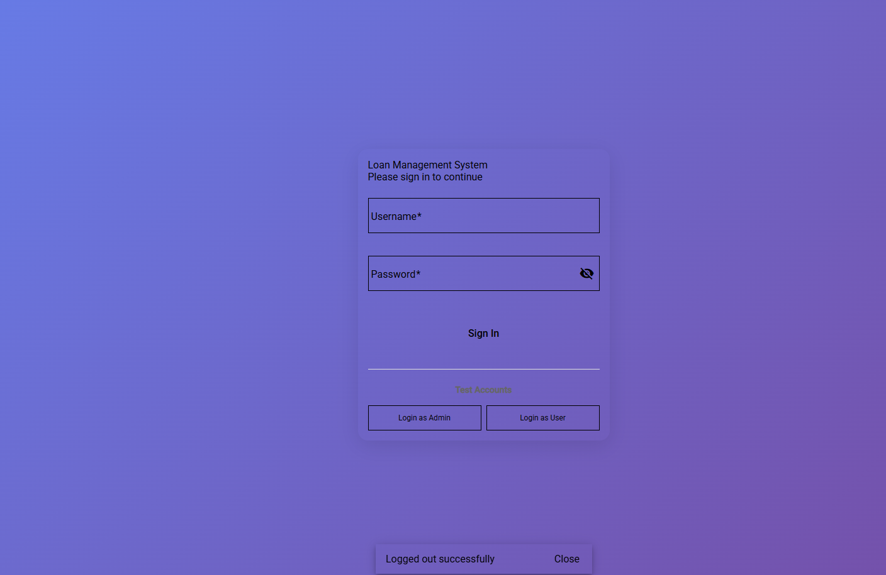
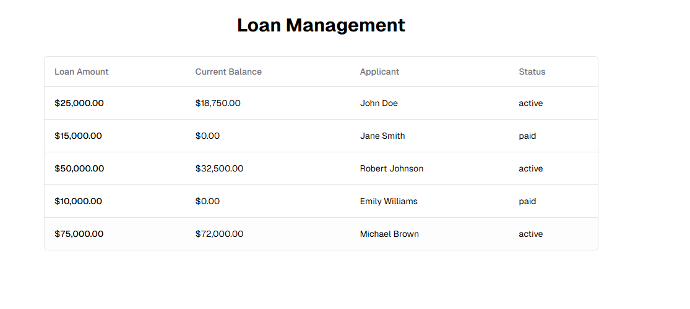

# About me




The project was completed in approximately 12 hours, with 4 hours to backend development, 3 hours to frontend development, and 2 hour to documentation, 3 hours to Bonus feature (error handling, logging, authentication, github actions).
The main challenge encountered was Docker orchestration, specifically managing multi-service containers with correct networking and dependency configurations.
If given more time, I would implement the following improvements:
1. Integration tests for API endpoints
2. Database indexing and query optimization
3. Caching strategies using Redis
4. Export functionality for PDF and Excel
5. Payment reminders and notification system

# Loan Management System

A full-stack loan management application built with .NET Core 6 backend and Angular 19 frontend.
This loan management system allows users to view, create, and make payments on loans.

##  Features

### Backend (.NET Core API)
- **RESTful API** Loan management endpoints
- **Entity Framework Core** SQL Server/In-Memory database support  
- **Comprehensive validation** Error handling
- **Unit and integration tests** xUnit
- **Docker support** Containerization
- **CORS configuration** Frontend integration

### Frontend (Angular)
- **Modern Angular 19** application with Angular Material
- **Responsive design** works on all devices
- **Real-time data** fetching from backend API
- **Payment processing** with quick action buttons
- **Loading states** and error handling

### Bonus
- **JWT Authentication** Secure user management with Bearer tokens
- **Structured Logging** Serilog with console and file outputs
- **Swagger/OpenAPI** Documentation with JWT Bearer support
- **GitHub Actions CI/CD** Automated testing and deployment pipeline

##  Technology

### Backend
- **.NET Core 6** - Cross-platform web framework
- **Entity Framework Core** - Object-relational mapping
- **SQL Server/In-Memory DB** - Data persistence
- **Swagger/OpenAPI** - API documentation
- **xUnit** - Testing framework

### Frontend
- **Angular 19** - Frontend framework
- **Angular Material** - UI component library
- **TypeScript** - Type-safe programming
- **SCSS** - Enhanced CSS with Sass
- **RxJS** - Reactive programming

### DevOps
- **Docker** - Containerization
- **Docker Compose** - Multi-container orchestration
- **Nginx** - Web server for frontend


##  API Endpoints

### Authentication Endpoints
| POST | `/api/Auth/login` | Login with username/password | No |
| POST | `/api/Auth/register` | Register new user | No |
| GET | `/api/Auth/me` | Get current user info | Yes |

### Loan Management Endpoints  
| GET | `/api/LoanManagement/loans` | Get all loans | Yes |
| GET | `/api/LoanManagement/loans/{id}` | Get loan by ID | Yes |
| POST | `/api/LoanManagement/loans` | Create new loan | Yes |
| POST | `/api/LoanManagement/loans/{id}/payment` | Make payment | Yes |

### Authentication
All loan management endpoints require JWT Bearer authentication. Include the token in the Authorization header:
```
Authorization: Bearer <your-jwt-token>
```

### Test Accounts
Pre-seeded users for testing:
- **Admin**: `admin` / `admin123` (Admin role)
- **User 1**: `user1` / `user123` (User role)  
- **User 2**: `user2` / `user123` (User role)

##  Bonus Features Implemented

### JWT Authentication
- **Secure Login/Register** system with password hashing (PBKDF2)
- **Role-based access control** (Admin/User roles)
- **JWT Bearer tokens** with 24-hour expiration
- **Protected endpoints** requiring authentication
- **User management** with pre-seeded test accounts

### Structured Logging (Serilog)
- **Console logging** with colored output and structured format
- **File logging** with daily rolling logs in `logs/` directory
- **Log correlation IDs** for tracking requests across services
- **Environment enrichment** with machine name and environment info
- **Configurable log levels** for different namespaces
- **Performance logging** for API operations

### GitHub Actions CI/CD Pipeline
- **Automated testing** on push and pull requests
- **Multi-stage builds** with caching for faster builds
- **Security scanning** for vulnerable packages
- **Code quality checks** with linting and formatting validation
- **Docker image building** and pushing to registry
- **Deployment pipelines** for staging and production environments
- **Test coverage reporting** with Codecov integration

### Enhanced Security
- **Password hashing** using PBKDF2 with salt
- **JWT token validation** with proper expiration handling
- **CORS configuration** for secure cross-origin requests
- **Input validation** and sanitization
- **Structured error handling** without data leakage

## How to Start

### Option 1: Docker Compose

**Prerequisites:**
- [Docker](https://docs.docker.com/get-docker/)
- [Docker Compose](https://docs.docker.com/compose/install/)

```bash
git clone <repository-url>
cd loan-management-system
docker-compose up --build

# Access the applications
# Frontend: http://localhost:4200
# Backend API: http://localhost:5000
# API Documentation: http://localhost:5000 (Swagger UI)
```

### Option 2: Manual Setup

#### Backend Setup

**Prerequisites:**
- [.NET 6 SDK](https://dotnet.microsoft.com/download/dotnet/6.0)

```bash
cd backend
dotnet restore
cd src/Fundo.Applications.WebApi
dotnet run

# API will be available at: http://localhost:5000
```

#### Frontend Setup

**Prerequisites:**
- [Node.js 18+](https://nodejs.org/)
- [Angular CLI](https://angular.io/cli)

```bash
cd frontend
npm install
npm start

# Application will be available at: http://localhost:4200
```

##  Testing

### Backend Tests
```bash
cd backend/src
dotnet test
```

### Frontend Tests
```bash
cd frontend
npm test
```